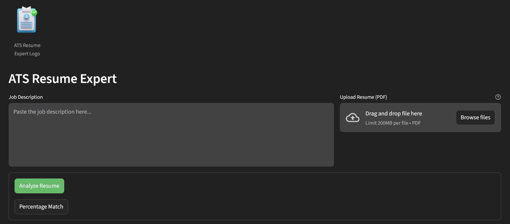

# ATS Resume Expert

## Overview

ATS Resume Expert is an Applicant Tracking System (ATS) powered by a
Large Language Model (LLM) to streamline the recruitment process. It
analyzes resumes against job descriptions, providing detailed
evaluations and percentage match scores to identify the best candidates.
The application is built with Streamlit and deployed on Streamlit Cloud
for an intuitive user experience.



## Features

-   **Resume Analysis**: Extracts and evaluates key information from
    resumes using Google's Gemini LLM, highlighting candidate strengths
    and weaknesses relative to job requirements.
-   **Percentage Match**: Calculates a percentage score indicating how
    well a resume matches a job description, including missing keywords
    and final thoughts.
-   **PDF Processing**: Converts uploaded PDF resumes to images for
    analysis, ensuring compatibility with the LLM.
-   **Customizable UI**: Features a dark-themed, responsive interface
    with styled buttons and containers for enhanced usability.
-   **Cloud Deployment**: Hosted on Streamlit Cloud for easy access
    without local setup.

## Demo

Try the application live at:
<https://vmsgmkoysechvgbvrfbw9q.streamlit.app/>

## Project Structure

-   `app.py`: Main Streamlit application script handling UI, user
    inputs, and API interactions.
-   `api_client.py`: Manages calls to the Google Gemini API for resume
    analysis.
-   `pdf_utils.py`: Handles PDF-to-image conversion and base64 encoding
    for LLM processing.
-   `prompts.py`: Defines prompts for resume analysis and percentage
    match evaluation.
-   `config.py`: Stores configuration settings like the Gemini model and
    image MIME type.
-   `config.toml`: Configures the Streamlit theme (dark mode with light
    green accents).
-   `requirements.txt`: Lists Python dependencies.
-   `packages.txt`: Specifies system-level dependencies (e.g.,
    `poppler-utils`).
-   `tests/test_pdf_utils.py`: Unit tests for PDF processing
    functionality.

## Prerequisites

-   Python 3.8 or higher
-   Streamlit Cloud account (for deployment)
-   Google API key for Gemini LLM access
-   Poppler-utils for PDF processing

## Installation

1.  Clone the repository:

    ``` bash
    git clone https://github.com/AsmaaMahmoudSaeed/ATS.git
    cd ATS
    ```

2.  Install system dependencies (for local setup):

    ``` bash
    sudo apt-get install poppler-utils
    ```

3.  Install Python dependencies:

    ``` bash
    pip install -r requirements.txt
    ```

4.  Set up environment variables:

    -   Create a `.streamlit/secrets.toml` file with your Google API
        key:

        ``` toml
        GOOGLE_API_KEY="your-api-key-here"
        ```

5.  Run the application locally:

    ``` bash
    streamlit run app.py
    ```

## Usage

1.  Access the deployed app via [Streamlit
    Cloud](https://vmsgmkoysechvgbvrfbw9q.streamlit.app/) or run
    locally.
2.  Paste a job description in the text area.
3.  Upload a resume in PDF format.
4.  Click **Analyze Resume** for a detailed evaluation or **Percentage
    Match** for a compatibility score.
5.  View results in an expandable container with styled formatting.

## Testing

Run unit tests to verify PDF processing functionality:

``` bash
pytest tests/
```

Ensure a sample PDF (`tests/sample.pdf`) is available for testing.

## Deployment

The app is deployed on Streamlit Cloud. To deploy your own instance:

1.  Push the repository to GitHub.
2.  Connect to Streamlit Cloud and select the repository.
3.  Configure `secrets.toml` with your Google API key in the Streamlit
    Cloud dashboard.
4.  Deploy the app and access it via the provided URL.

## Contributing

1.  Fork the repository.
2.  Create a feature branch (`git checkout -b feature-branch`).
3.  Commit changes (`git commit -m 'Add feature'`).
4.  Push to the branch (`git push origin feature-branch`).
5.  Open a pull request.

## License

This project is licensed under the MIT License. See the
[LICENSE](LICENSE) file for details.

## Contact

For questions or feedback, contact the repository owner via GitHub.
